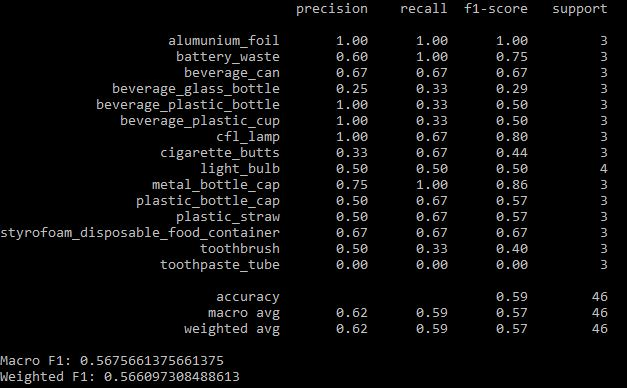
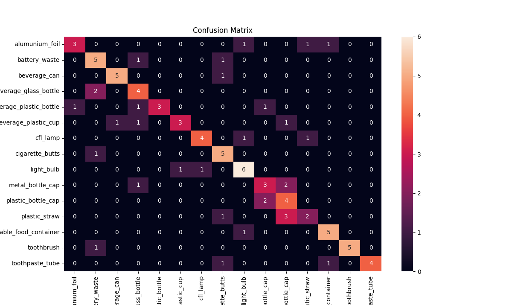
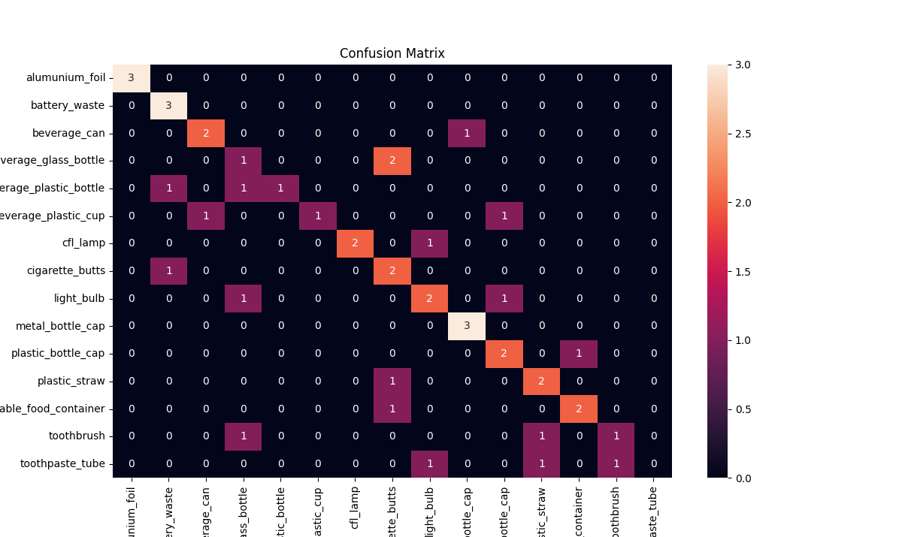

# Waste Image Classification using EfficientNet-B1 & Pytorch
End-to-end computer vision project for household waste image classification using EfficientNet-B1 with PyTorch.

This project presents a complete computer vision pipeline for classifying household waste images into 15 categories using an EfficientNet-B1 model built with PyTorch.
The project covers dataset preparation, transfer learning, model training, evaluation, local deployment, and performance analysis.

---
## Project Highlights
- End-to-end ML pipeline (data → training → evaluation → deployment)
- Transfer Learning using EfficientNet-B1
- Custom evaluation script (PyTorch-based)
- Local offline inference
- Real-world waste sorting simulation

---
## Key Features
- Multi-class image classification (15 categories)
- Local inference using PyTorch
- GUI-based image selection (Tkinter)
- Confidence score prediction
- Custom evaluation script
- Confusion Matrix
- Classification Report
- Macro & Weighted F1 Score

---
## Project Structure

---
## Instalation
Clone this repository:
git clone https://github.com/septiandwitomo39/waste-ImageClassification-EfficientNetB1.git

cd waste-ImageClassification-EfficientNetB1

install Dependencies :
pip install -r requirements.txt

---
## Dataset

The dataset used in this project is included in `dataset_trial.zip` for educational and reproducibility purposes.

The dataset contains 15 waste categories and was used for training, validation, and testing.

> The dataset is provided for educational purposes as part of this project.

---
## Usage
### a. Run Model Evaluation
Evaluate the trained model on the validation or test dataset.
```bash
python deployment/evaluate.py
```
```
This script provides:

- Validation / Test Accuracy
- Macro F1 Score
- Weighted F1 Score
- Classification Report
- Confusion Matrix Visualization
```

### b. Run Local Prediction
Predict a single image using the trained EfficientNet-B1 model.
```bash
python deployment/predict.py
```
```
Features:

- Image selection using Tkinter GUI
- Predicted class
- Confidence score
- Offline inference using PyTorch
```

### c. Model File
The trained model is stored in:

```text
model/best.pt
```
The prediction and evaluation scripts automatically load this model.

---
## Local Inference
This project performs inference entirely on the local machine using PyTorch.
No internet connection, cloud service, or external API is required.
The trained model (`best.pt`) is loaded directly from the local repository for both prediction and evaluation.

---
## Model Details
- Model Architecture : EfficientNet-B1
- Framework : PyTorch
- Transfer Learning : Yes
- Task : Multi-class Image Classification
- Number of Classes : 15
- Training Images : 323
- Validation Images : 93
- Test Images : 46
- Input Size : 224 × 224

---
## 📈 Training Performance

The training and validation curves show the model's learning progression across 50 training epochs.


---
## Performance Summary
The model was evaluated on both validation and test datasets to measure its ability to generalize to unseen data.

### a. Validation Performance
The model was evaluated on 93 validation images across 15 waste categories.
| Metric | Score |
|---|---:|
| Accuracy | **69.89%** |
| Macro F1 Score | **69.39%** |
| Weighted F1 Score | **69.71%** |


### b. Test Performance
The model was further evaluated on 46 unseen test images across 15 waste categories.
| Metric | Score |
|---|---:|
| Accuracy | **58.70%** |
| Macro F1 Score | **56.76%** |
| Weighted F1 Score | **56.61%** |



---
## Confusion Matrix
### Validation Set
The confusion matrix below shows the prediction distribution across the 15 waste categories on the validation dataset.


### Test Set
The confusion matrix below shows the prediction distribution across the 15 waste categories on the unseen test dataset.


---
## Key Insights
- EfficientNet-B1 achieved **69.89% validation accuracy** and **58.70% test accuracy** across 15 waste categories.
- The model performs better on visually distinctive categories, while several visually similar or less-represented categories remain challenging.
- The drop in performance from validation to test data indicates that the model's generalization to unseen images can still be improved.
- Class-level performance varies considerably, as shown by the classification reports and confusion matrices.
- Increasing dataset size and diversity is likely to improve model robustness and generalization.
  
---
## Limitation
- Relatively small dataset (~21 training images per class on average)
- Limited image diversity across some waste categories
- Performance drops on unseen test images
- Visually similar categories remain challenging for the model
  
---
## Future Improvements
- Increase dataset size and image diversity
- Improve class balance across categories
- Experiment with additional CNN architectures
- Develop a web-based inference application using Gradio
- Deploy the application to Hugging Face Spaces

---
## Skills Demonstrated
- Computer Vision — Multi-class Image Classification
- Transfer Learning with EfficientNet-B1
- PyTorch Model Development & Deployment
- Dataset Preparation & Image Preprocessing
- Data Augmentation
- Model Evaluation
- Classification Report & Confusion Matrix Analysis
- Precision, Recall & F1-Score Analysis
- Local Offline Inference
- Python Application Development with Tkinter
- Git & GitHub Project Management

---
## 👤 Author

### Septian Dwitomo

Computer Vision Enthusiast | AI Engineer in Progress

- GitHub: [@Septiandwitomo39](https://github.com/Septiandwitomo39)
- Focus: Computer Vision, Image Classification, and Machine Learning
